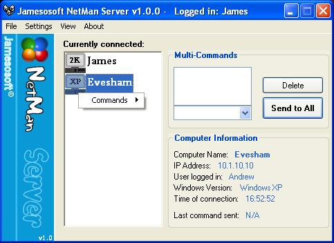



## NetMan \- Complete Network Controlling Application

### Description

This is code for a Complete Network Administration Program. It is designed for use by a Network Administrator to have FULL Visual control over any number of "client" machines in a network, (using ANY windows Version). You can control the mouse and keyboard as you would your own, on more than One of the client machines at once.

It has many other functions such as simply observing a client machine, Freezing the client machine to prevent any user access (even using Ctrl/Alt/Del), Sending Messages to the users of Client Machines, and Shutting Down/Logging Off users of the client machines.

I have spent a lot of time Ironing out as many Bugs from this code as possible, and have developed an extremely User-Friendly interface for it.

To Use the application you need to Download DIJpg.dll from "www.disoft.com". It comes in C source code or Compiled. Then Place the Dll into the "Windows\System32" folder of all of the Client machines. I apologise for this inconvenience and would rather have code inside the application to convert Bitmaps to Jpeg files but do not have the experience for developing this. I would have included the source for the DLL with my code but my internet connection is too slow to upload 300kb!!! (56k) The DLL works great though!

Finally, please read the readme file contained within the ZIP file as it contains a lot of information on the various functions the application can perform that are not readily visible.

Thanks for looking at this and please leave a comment if you download it. It is my first completed application so I hope you like it. I welcome advice on improvements/ additions and reports of any bugs you encounter.

(The AUTHORISATION PASSWORD is "BOB". - This will help you log in when you first compile and run the program!)
 
### More Info
 

             |
---                |---
**Submitted On**   |2003-01-15 23:06:56
**By**             |[James Ricketts](https://github.com/Planet-Source-Code/PSCIndex/blob/master/ByAuthor/james-ricketts.md)
**Level**          |Beginner
**User Rating**    |4.8 (101 globes from 21 users)
**Compatibility**  |VB 6\.0
**Category**       |[Complete Applications](https://github.com/Planet-Source-Code/PSCIndex/blob/master/ByCategory/complete-applications__1-27.md)
**World**          |[Visual Basic](https://github.com/Planet-Source-Code/PSCIndex/blob/master/ByWorld/visual-basic.md)
**Archive File**   |[NetMan\_\-\_C1530591172003\.zip](https://github.com/Planet-Source-Code/james-ricketts-netman-complete-network-controlling-application__1-42503/archive/master.zip)

